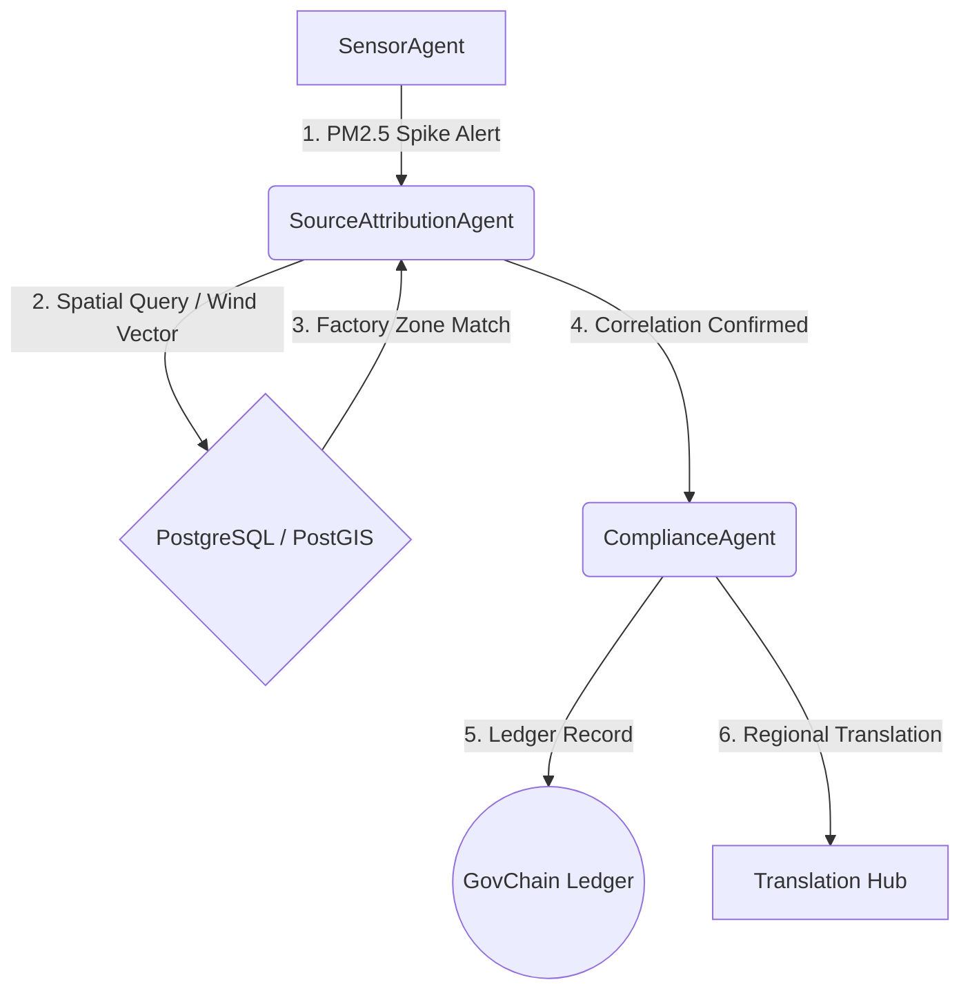

# VayuSense - Technical Architecture Blueprint

This document details the software, database, and operational architecture of VayuSense.

---

## 1. Technology Stack

VayuSense utilizes a targeted, production-ready stack for maximum performance, spatial precision, and modularity:

| Component | Technology | Description |
| :--- | :--- | :--- |
| **Frontend Framework** | Next.js 14 (App Router) | Handles client-side view rendering, state-driven interfaces, and static page pre-generation. |
| **Styling & Theme** | Tailwind CSS | Utility-first styling optimized for glassmorphic elements and dark modes. |
| **Icon Library** | Google Material Symbols | Vector icons for minimal DOM footprint. |
| **Geospatial Engine** | Mapbox GL JS & Uber H3 | Renders vector-traced South Mumbai boundaries and resolution-8 hexagonal overlay structures. |
| **Database** | PostgreSQL & PostGIS | Relational storage utilizing PostGIS spatial indexing for coordinates, zones, and perimeters. |
| **Multi-Agent Pipeline**| CrewAI | Configures agent execution, role-based workflows, and inter-agent sync messaging. |
| **Inference Framework** | Python FastAPI | Distributes training and inference jobs for the XGBoost predictive models. |

---

## 2. PostgreSQL & PostGIS Spatial Schema

The system uses a single source of truth database stack. Geometries are index-optimized using `GIST` indexing:

```sql
-- Enable PostGIS spatial extensions
CREATE EXTENSION IF NOT EXISTS postgis;

-- 1. IoT Sensor Nodes Table
CREATE TABLE sensor_nodes (
    node_id VARCHAR(50) PRIMARY KEY,
    name VARCHAR(100) NOT NULL,
    geom GEOMETRY(Point, 4326) NOT NULL, -- WGS84 coordinate index
    h3_index VARCHAR(15) NOT NULL,       -- Uber H3 spatial cell mapping
    status VARCHAR(20) DEFAULT 'nominal',
    last_reading JSONB                   -- Holds PM2.5, PM10, NO2 indices
);

CREATE INDEX idx_sensor_nodes_geom ON sensor_nodes USING GIST(geom);
CREATE INDEX idx_sensor_nodes_h3 ON sensor_nodes(h3_index);

-- 2. Factory Industrial Perimeters Table
CREATE TABLE industrial_zones (
    zone_id VARCHAR(50) PRIMARY KEY,
    owner_name VARCHAR(100) NOT NULL,
    geom GEOMETRY(Polygon, 4326) NOT NULL,
    emission_cap DECIMAL(5, 2) NOT NULL,
    is_active_capping BOOLEAN DEFAULT TRUE
);

CREATE INDEX idx_industrial_zones_geom ON industrial_zones USING GIST(geom);

-- 3. Live Traffic Segments Table
CREATE TABLE traffic_segments (
    segment_id VARCHAR(50) PRIMARY KEY,
    street_name VARCHAR(100),
    geom GEOMETRY(LineString, 4326) NOT NULL,
    congestion_level DECIMAL(3, 2) NOT NULL
);

CREATE INDEX idx_traffic_segments_geom ON traffic_segments USING GIST(geom);
```

---

## 3. Network & Component Topology Flow

The `/dashboard/agent-logs/topology` route utilizes a relative grid panel to map out real-time agent handshakes. In the production deployment, this maps to **React Flow** to visualize structural node logic:



- **React Flow Integration**: Renders visual interactive handles, lines, and custom HTML wrapper nodes representing each active service, showing running processes and traffic logs dynamically.
