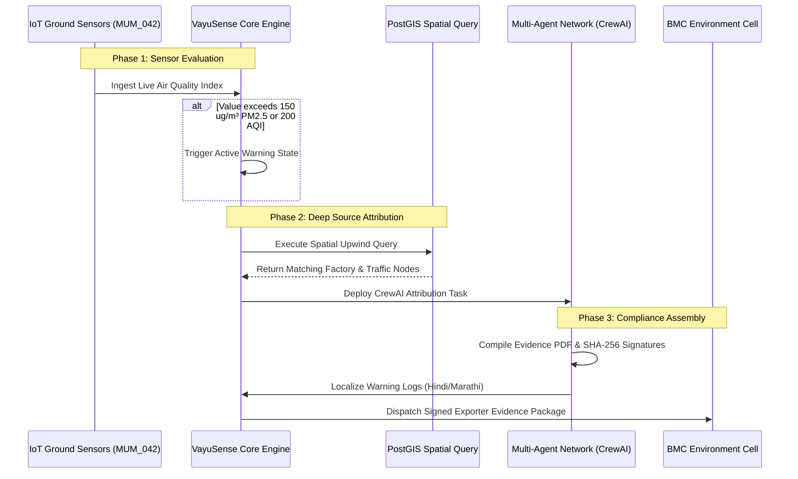

# VayuSense - Execution Cycles & Telemetry Lifecycles

This document outlines the three phases of VayuSense's automated telemetry lifecycle, spanning sensor evaluation, attribution analysis, and compliance reporting.

---

## The 3-Phase Telemetry Pipeline

---

## 1. Phase 1: Sensor Evaluation
- **Trigger**: Continuous data ingestion from IoT ground devices (e.g. static sensor node `MUM_042`).
- **Evaluation**: The sensor checks if live telemetry breaches the `pmThreshold` (150 µg/m³) or `aqiThreshold` (200).
- **Escalation**: Upon breaching, the system transitions from nominal status to active warning mode. A warning highlight is placed over the mapped H3 hexagon grid.

---

## 2. Phase 2: Deep Source Attribution
- **Analysis**: The system triggers an upwind vector spatial analysis to trace the path of wind and identify the likely emission sources.
- **Database Query**: A PostGIS spatial join checks for intersecting polygons in `industrial_zones` and line strings in `traffic_segments` located inside the upwind corridor coordinates.
- **Attribution Match**: The `SourceAttributionAgent` processes the dataset to calculate source contribution percentages (e.g. Industrial: 42%, Construction: 38%, Diesel Fleet: 20%).

---

## 3. Phase 3: Compliance Report Assembly
- **Notice Generation**: The `ComplianceAgent` automatically generates a structured statutory enforcement notice containing the source attribution evidence, PostGIS coordinates, and timestamp.
- **Regional Localization**: The document is routed through the **Regional Language Translation Hub**, creating parallel translation layers in Hindi and Marathi to ensure clear legal notification.
- **Municipal Dispatch**: The finalized evidence bundle is signed using SHA-256 and sent to the BMC Environment & Disaster Management Cell for enforcement routing.
