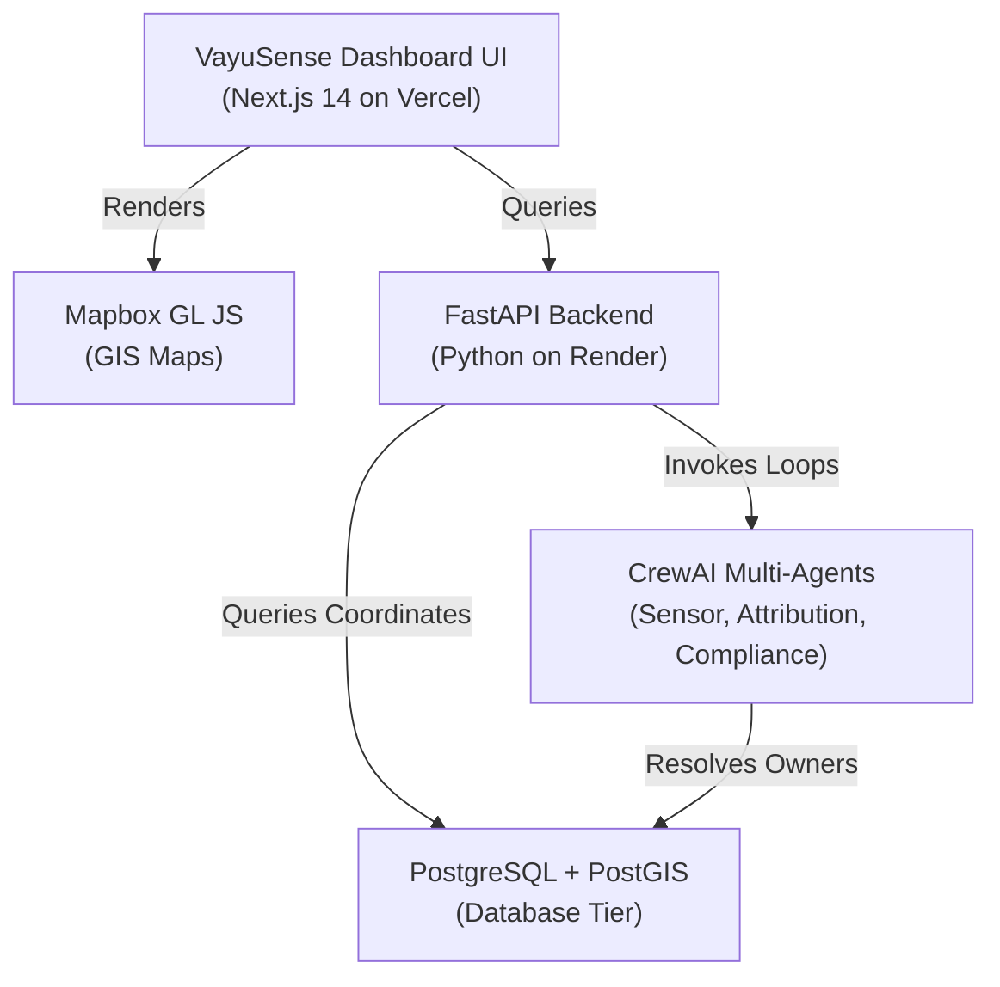

# 📡 VayuSense: Autonomous Environmental Command & Spatial Attribution Engine

[](#)
[](https://vayusense-nu.vercel.app/dashboard/home)
[](https://vayusense-backend.onrender.com/health)
[](LICENSE)

VayuSense is an enterprise-grade Municipal Environmental Monitoring, Source Attribution & Automated Compliance Enforcement engine designed to safeguard air quality across dense urban zones. Operating over **277 Municipal Corporations in all 28 Indian States and Delhi UT**, the platform fuses continuous ground-level IoT CAAQMS sensors, high-altitude European Space Agency (ESA) Sentinel-5P satellite rasters, and machine learning scenario models to pinpoint polluters and deploy legally binding statutory compliance orders automatically.

Under the hood, when air quality breaches the regulatory limit (AQI > 200), VayuSense initiates an **Autonomous Multi-Agent Crew Pipeline** that executes in under 5 seconds:
*   **🔬 SensorAgent** monitors real-time telemetry streams, filtering out false positives by running local sensor drift and meteorological delta calibrations.
*   **📡 SourceAttributionAgent** immediately isolates the breach grid, running PostGIS spatial vector queries to correlate local wind vectors with Sentinel-5P satellite plumes to determine blameworthiness percentage.
*   **⚖️ ComplianceAgent** cross-checks municipal permits and automatically compiles, signs, and dispatches a cryptographically secure (SHA-256) regional show-cause notice PDF.

---

## 🚀 Live Production Links
*   🖥️ **Live Web Dashboard (Vercel):** [https://vayusense-nu.vercel.app/dashboard/home](https://vayusense-nu.vercel.app/dashboard/home)
*   📚 **Interactive Developer Portal:** [https://vayusense-nu.vercel.app/dashboard/docs](https://vayusense-nu.vercel.app/dashboard/docs)
*   🐍 **AI Backend Server (Render):** [https://vayusense-backend.onrender.com](https://vayusense-backend.onrender.com)
*   📖 **Interactive Swagger OpenAPI Docs:** [https://vayusense-backend.onrender.com/docs](https://vayusense-backend.onrender.com/docs)

---

## ⚡ Core Technical Features
1.  **Pan-India Municipal Multitenancy**: Instant context-switching across all 28 Indian States and Delhi UT (covering 277 total corporations) with automatic highest-AQI hotspot routing and dynamic statutory PDF directories.
2.  **3 Major Emission Factors System**: Visual GIS map layers representing:
    *   ▲ **Industrial & Power (50% Impact):** Yellow triangle zones ($\text{SO}_2, \text{NO}_x, \text{PM}_{2.5}, \text{Pb}$).
    *   ● **Vehicular Exhaust (30% Impact):** Cyan circular corridors ($\text{NO}_2$, Black Carbon).
    *   ■ **Construction Dust (20% Impact):** Purple square grids ($\text{PM}_{10}$).
3.  **ESA Sentinel-5P Plume Layer**: Overhead tropospheric columns rendered in Electric Indigo (`#6366f1`) with pulsing satellite beacons (`📡`).
4.  **Ensemble Forecasting Models**: Auto-regressive 12-hour hyperlocal forecasting using a weighted ensemble of Random Forest and XGBoost Regressor models.
5.  **Developer Docs & API Sandbox Portal**: Client-side interactive testing playground featuring copy-paste ready Python/cURL requests, live execution parameters, and Swagger references.

---

## 🛠️ Technology Stack
*   **Frontend UI**: Next.js 14 App Router, React, Tailwind CSS (Glassmorphic Midnight design system).
*   **GIS Rendering**: Mapbox GL JS, GeoJSON Polygon Overlays, Uber H3 Spatial Grid (Resolution 8).
*   **Backend Server**: Python 3.11, FastAPI, Uvicorn, SQLAlchemy, Pydantic.
*   **Agentic Framework**: CrewAI (Multi-agent orchestration).
*   **Database Tier**: PostgreSQL 15, PostGIS extension (Spatial index mapping).
*   **PDF Compiler**: Native Client-Side jsPDF.

---

## 🎛️ System Architecture Blueprint



---

## ⚙️ Local Development & Setup

### 🔑 1. Environment Variables Configuration
Create a `.env.local` file inside the `frontend/` directory and populate it with the following credentials (replace placeholders with your actual keys):

```env
NEXT_PUBLIC_MAPBOX_ACCESS_TOKEN=your_mapbox_public_access_token_here
COPERNICUS_CLIENT_ID=your_copernicus_client_id_here
COPERNICUS_CLIENT_SECRET=your_copernicus_client_secret_here
OPENAQ_API_KEY=your_openaq_api_key_here
OPEN_METEO_API_URL=https://air-quality-api.open-meteo.com/v1/air-quality
NEXT_PUBLIC_API_BASE_URL=https://vayusense-backend.onrender.com
```

### 💻 2. Run Frontend Locally
```bash
cd frontend
npm install
npm run dev
```
Open **[http://localhost:3000](http://localhost:3000)** in your browser.

### 🐍 3. Run Backend Locally
Ensure Python 3.11 is installed, then set up the virtual environment:
```bash
cd backend
python -m venv .venv
source .venv/bin/activate
pip install -r requirements.txt
uvicorn app.main:app --host 0.0.0.0 --port 8000 --reload
```
The FastAPI swagger documentation will be available locally at **[http://localhost:8000/docs](http://localhost:8000/docs)**.